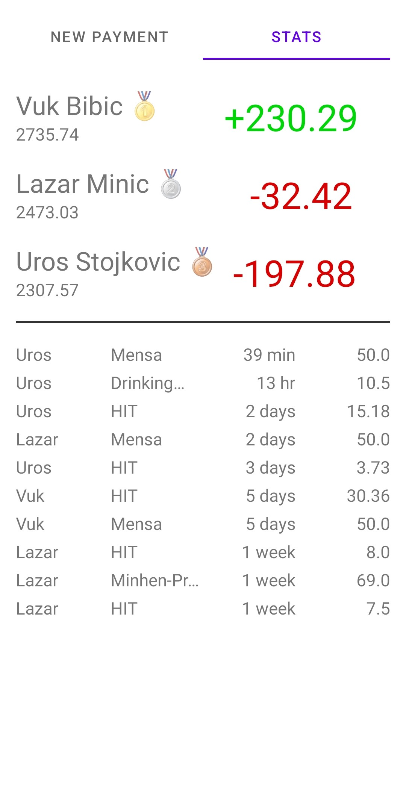

# Common Wallet
*CommonWallet* is a simple app for groups of people to record, track and share everyday payments.
## Motivation
*CommonWallet* has been developed to help me and my friends share and monitor our living expenses during our Master Studies at Technical University of Munich.
## Architecture
*CommonWallet* consists of three layers:
 - Serverless Azure SQL Database for persistance
 - Http-Triggered Azure Function App for REST API (written in .NET)
 - Android App as Frontend (written in Kotlin)
 - (there's also a super simple React frontend)
 ## Sneak peek

    
    

